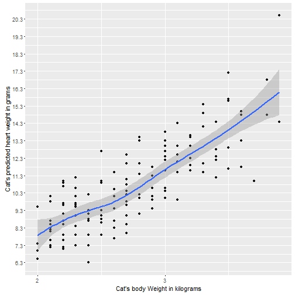

Developing Data Products
========================================================
author: Alexandre Dufresne
date: February 28th, 2016

Introduction to a proof of concept **Shiny Application**

Course Project
========================================================

* The project consists in two activities:
 + A **Shiny** application
 + A presentation in Slidify or **Rstudio Presenter** to pitch for the application.
* This is a Rpresentation for the Course Project of the "Developing data products" class
* This course is part of the "Data Science specialization"

Shiny App - Source 
========================================================

* For this assignment, I used the `cats` dataset, available within the package `UsingR`.
* This application uses the information available in a dataset collected and used by R. A. Fisher in 1947, to study the relationship between a part and a whole, in the context of the weight of a cat's body and a cat's heart.

Shiny App - Data 
========================================================

* Here's some information about the dataset:


```r
library("UsingR")
data(cats)
summary(cats)
```

```
 Sex         Bwt             Hwt       
 F:47   Min.   :2.000   Min.   : 6.30  
 M:97   1st Qu.:2.300   1st Qu.: 8.95  
        Median :2.700   Median :10.10  
        Mean   :2.724   Mean   :10.63  
        3rd Qu.:3.025   3rd Qu.:12.12  
        Max.   :3.900   Max.   :20.50  
```

Shiny App - Model
========================================================

* I used the **lm** function to fit a linear model based on the dataset. 
* We're able to estimate the probable weight of a cat's heart
* This is done by infering the heart weight based on the body weight


```

Call:
lm(formula = Hwt ~ Bwt, data = cats)

Coefficients:
(Intercept)          Bwt  
    -0.3567       4.0341  
```

Shiny App - Regression 
========================================================

* Here's a visualization of the data, where each dot represents an observation of the dataset.
* The regression line is shown in blue, with a 95% confidence interval as shown by the shaded area.
* The app allows the user to select a given cat weight and will predict its heart weight.

***



Shiny App - Useful Links
========================================================

The Shiny app can be consulted by clicking here:

* https://americalex.shinyapps.io/DDPCP/

The Rpresentation -the reproducible pitch- is found here:

* http://rpubs.com/Americalex/DDPCP

The source files for this project are available on github:

* https://github.com/americalex/DDPCP/
